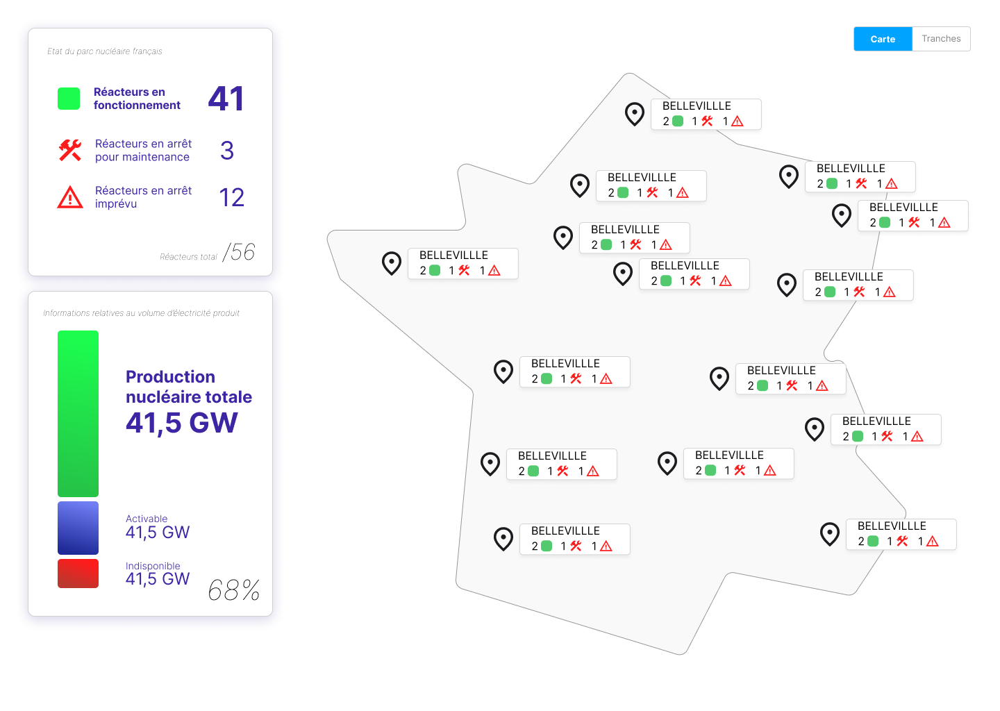

# Push_Nuke
## Carte Moyens de production actifs
RTE souhaiterait communiquer aux français de façon automatique les indisponibilités des moyens de production sur une carte de France.
Le but de ce projet est d'afficher sur une carte de France, les moyens de production disponibles ou indisponibles à partir de la source des données RTE

### Régles de gestion
#### RG1 : Affichage sur une carte de France
Afficher sur une carte l'ensemble des moyens de production (centrale, plant) identifiés par type de production (nucléaire, hydrolien, éolien, solaire ) à partir de coordonnées réelles.
Dans un premier temps seuls les moyens de production de type nucléaire s'afficheront.
#### RG2 : Encart Moyen de production 
##### RG2.1 Affichage des encarts
Pour chaque moyen de production, identifier sur la carte le nom du moyen de production, En dessous doit apparaître le nombre de tranches disponibles, indisponibles sur arrêt prévu et indisponibles sur arrêt imprévu.
Gérer à ce que les encarts soient décaler pour éviter de perdre de la visibilité.
##### RG2.2 Identifier les centrales (moyens de production) dont les tranches sont indisponibles
Dans les données sources de l'API UNAVAILABILITY ADDITIONAL INFORMATION, prendre les dernières mises à jour uniquement dont
* latest_version=true
* status = ACTIVE
* start_date <= currentDate <= end_date.
* Ne comptabiliser les indisponibilités qu'une seule fois par tranche (à partir de **unit > name**) si plusieurs indisponibilités sont déclarées pour la même tranche ou par moyen de production (centrale), ne prendre en compte que la plus récente (à partir du champ **updated_date**)
##### RG2.3 Identifier les nombres à afficher par moyen de production
* unit > type = GENERATING_UNIT: seule la tranche en question est à comptabiliser.
* unit > type = PRODUCTION_UNIT: comptabiliser la centrale en entier (toutes les tranches sont indisponibles si au moins une tranche est indisponible)
* type = PLANNED_MAINTENANCE => indisponible sur arrêt prévu
* type = FORCED_UNAVAILABILITY => indisponible sur arrêt imprévu
* Disponible = Total - Indisponible
#### RG3 : Fichier de paramètres
La géolocalisation et l'ensemble des moyens de production sont  identifiés dans un fichier de paramètres (format au choix). Ce fichier doit pouvoir être mis à jour.
Dans ce fichier doit apparaître :
* la géolocalisation à positionner sur la carte
* Le nom du moyen de production dans les données sources
* Le nom à afficher sur la carte
* Type de moyen de production (nuclear)
* le nombre de tranches (pour pouvoir comptabiliser les tranches disponibles)
 
#### RG4 : Source des données de disponibilité
Récupérer les informations de disponibilités des moyens de productions de l'**API UNAVAILABILITY ADDITIONAL INFORMATION**

## Encart Nombre tranche totale et encart Puissance totale active

Dans un **encart** en haut/gauche de l'écran, l'utilisateur doit pouvoir visualiser les nombres totaux de moyens de production actifs ou en maintenance (forcée ou prévue).
Dans un encart en bas/gauche de l'écran, l'utilisateur doit pouvoir visualiser la puissance en service totale disponible actuelle et les capacités non disponibles.

### Régles de gestion
#### RG1 : Encart nombre des moyens de production
Présenter les trois nombres suivants sur l'écran :
* Le nombre total des réacteurs en fonctionnement
* Le nombre total des réacteurs en arrêt pour maintenance
* Le nombre total des réacteurs en arrêt imprévu
##### RG1.1 Réacteurs en fonctionnement 
Doit être déterminé en additionnant l'ensemble des nombre de tranches disponibles par centrale affichée à l'écran (uniquement nucléaire dans une première version)
###### RG1.2 Réacteurs en arrêt pour maintenance
Doit être déterminé en additionnant l'ensemble des tranches indisponibles en arrêt pour maintenance par centrale affichée à l'écran (uniquement nucléaire dans une première version)
##### RG1.3 Réacteurs en arrêt imprévu
Doit être déterminé en additionnant l'ensemble des nombre des tranches indisponibles en arrêt imprévu par centrale affichée à l'écran (uniquement nucléaire dans une première version)
#### RG2 : Encart Production totale
Présenter les deux nombres suivants sur l'écran :
* Production nucléaire totale : nombre total puissance active en GW
* Indisponible  : nombre total de puissance indisponible en GW
##### RG2.1 Indisponible 
Déterminée à partir de la somme de toutes les unavailable_capacity des tranches (GENERATING_UNIT) ou centrale/groupe (PRODUCTION_UNIT) pour les disponibilités actives réceptionnées.
Il doit être réalisé les actions suivantes :
* Faire la conversion en GW à savoir que 1GW = 1000MW.
* Ne prendre en compte qu'une fois les indisponibilités par tranche.
* Ne prendre en compte que l'indisponibilité par centrale/groupe si elle existe et pas les indisponibilités par tranche sur cette même centrale s'il y en a?
 
##### RG2.2 Production nucléaire totale
Déterminée à partir de la puissance totale de tous les réacteurs (somme de la colonne **netPower_MW**) si aucune indisponibilité n'est remontée (soit 63,01 GW)

